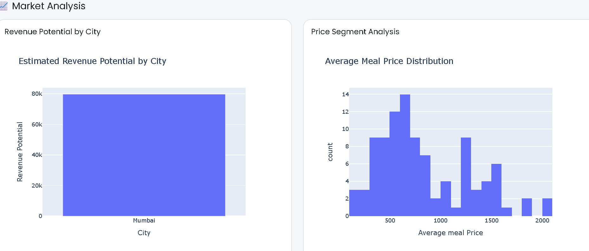
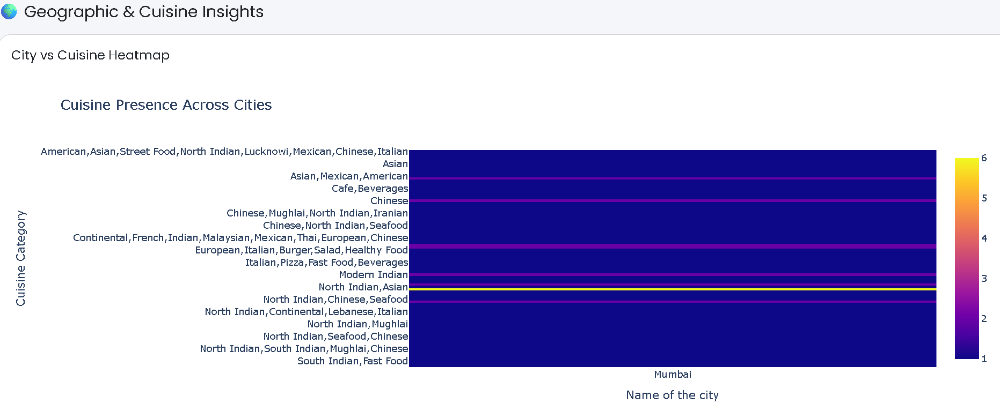
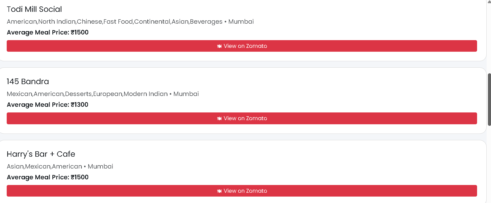
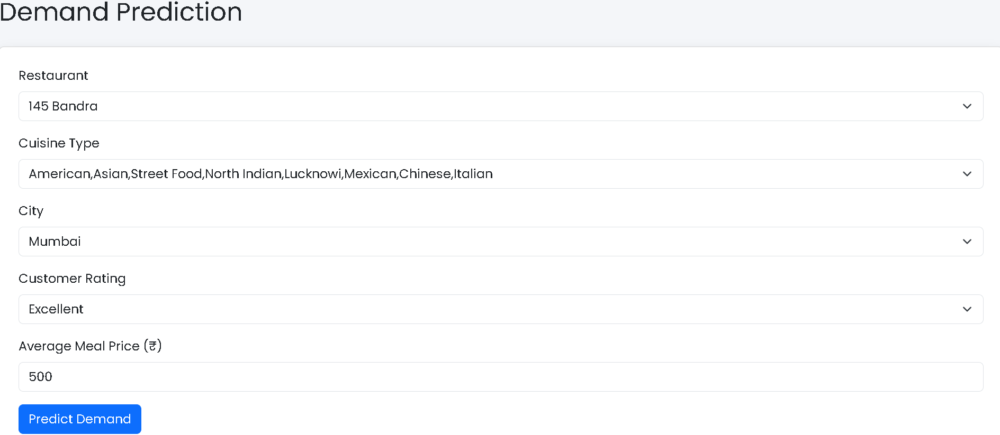
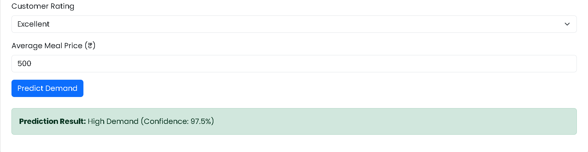

# 🍽️ FoodHub Demand Insights System

A full-stack restaurant analytics and demand prediction web application built using Flask, Python, Machine Learning, and Plotly.

## 🚀 Live Demo

https://foodhub-demand-insights.onrender.com

## 📸 Screenshots

### 📊 Dashboard Views

---

### 🍽️ Recommendation System

---

### 🤖 Prediction System

## 📌 Features

* Interactive analytics dashboard
* Restaurant demand prediction
* Cuisine analysis
* Price segment insights
* Dynamic charts and visualizations
* Automated business insights
* Responsive modern UI
* GitHub + Render deployment

## 🛠️ Technologies Used

* Python
* Flask
* Pandas
* Scikit-learn
* Plotly
* HTML/CSS
* Bootstrap
* GitHub
* Render

## 📊 Project Overview

This project analyzes restaurant and food delivery data to generate business insights and predict demand patterns through an interactive dashboard.

## 🌐 Deployment

The project is deployed live using Render with GitHub integration for automatic updates.

## 👨‍💻 Developer

Aditya Nambiar
